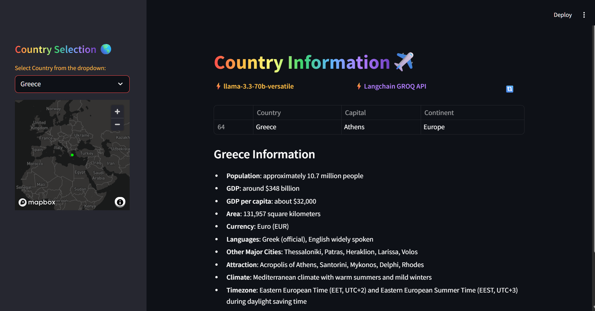

# Country Data Project

This project provides tools for scraping, analyzing, and visualizing country-related data. It includes the following components:

## Files

### `country_data.py`
This script contains functions and classes for processing and analyzing country data. It serves as the core module for handling data operations.

### `webscrapper.py`
This script is responsible for scraping country-related data from various web sources. It includes methods for fetching, parsing, and storing the data.

### `Dockerfile`
This file is used to containerize the project, enabling easy deployment and consistent runtime environments. It defines the necessary steps to build a Docker image for the project.

### `pyproject.toml`
This file is used to configure and manage the project’s build system and dependencies. It provides metadata about the project and specifies the tools required for building and packaging.

## Setup
1. Clone the repository:
    ```bash
    git clone https://github.com/yourusername/country_data.git
    cd country_data
    ```
2. Create a `.env` file in the project directory and add your API key:
    ```bash
    GROQ_API_KEY=your_api_key_here
    ```
3. Optionally, build and run the Docker container:
    ```bash
    docker build -t sudipto19/country_data .
    docker run -it --env-file=/home/<path_to_project>/country_data/.env sudipto19/country_data
    ```
   Alternatively, run the container in detached mode:
    ```bash
    docker run -d --env-file=/home/<path_to_project>/country_data/.env sudipto19/country_data
    ```
4. Optionally you can run the Streamlit app directly from host:
    ```bash
    uv run streamlit run main.py
    ```

## Requirements
- Python 3.x
- Docker (optional, for containerization)
- Required libraries (listed in `pyproject.toml`)

## End Result


## License
This project is licensed under the MIT License. See the `LICENSE` file for details.